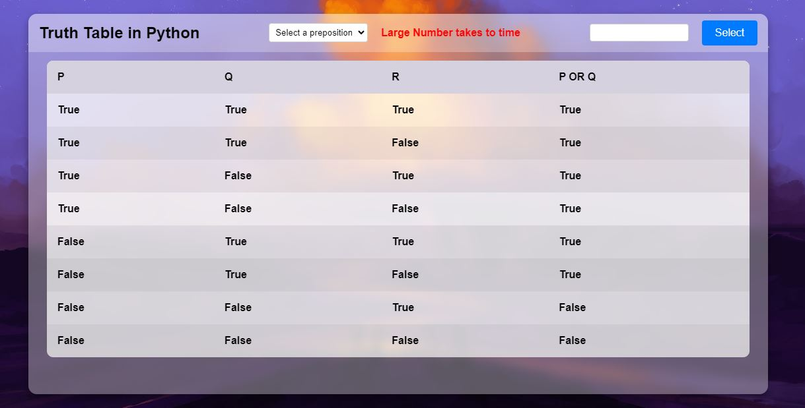

# [Live](https://5ig-bold-avogadro.circumeo-apps.net/)

# Truth Table Generator in Python

This Django web application generates and displays truth tables based on user-selected variables and logical prepositions. It provides a simple interface for creating truth tables and visualizing the results of logical operations.


## Features

- **Variable Selection:** Users can select the number of variables for generating the truth table.
- **Preposition Selection:** Choose from various logical prepositions like AND, OR, NAND, NOR, XOR, XNOR, IMPLIES, and BICOND
- **Dynamic Truth Table Generation:**  The application dynamically generates the truth table based on user inputs and displays the results.
- **Negation Handling:** Automatically handles negation when only one variable is selected.

- **Error Handling:** Provides user feedback and error messages for invalid inputs.

### Overview
- Truth Table Generation

Displays a dynamically generated truth table based on user-selected variables and prepositions.

## Installation

1. **Clone the repository:**
    ```bash
    https://github.com/Sohail342/TruthTable_Python
    ```

2. **Create a virtual environment:**
    ```bash
    python3 -m venv env
    source env/bin/activate  # On Windows use `env\Scripts\activate`
    ```

3. **Install dependencies:**
    ```bash
    pip install -r requirements.txt
    ```

4. **Run migrations:**
    ```bash
    python manage.py migrate
    ```

5. **Create a superuser:**
    ```bash
    python manage.py createsuperuser
    ```

6. **Run the development server:**
    ```bash
    python manage.py runserver
    ```

7. **Access the application:**
    Open your browser and go to `http://127.0.0.1:8000`

## Usage

### Truth Table Generation

The application allows users to generate truth tables for up to 4 variables. The user can select a logical preposition and view the results directly on the dashboard.

### Error Handling

If the user provides invalid input, such as selecting an unsupported number of variables or prepositions, the application will display an appropriate error message and prompt the user to correct their input.

### Code Overview

#### Logic
- **generate_truth_table:** Generates the truth table based on the number of variables.

- **generate_prepositions:** Applies the selected logical preposition to the variables and updates the truth table accordingly.

## Contact

If you have any questions or feedback, feel free to reach out:

<p align="left">
<a href="https://wa.me/+923428041928" target="blank"></a>
<a href="https://www.hackerrank.com/sohail_ahmad342" target="blank"></a>
<a href="https://www.linkedin.com/in/sohailahmad3428041928/" target="blank"></a>
<a href="https://instagram.com/sohail_ahmed113" target="blank"></a>
<a href="mailto:sohailahmed34280@gmail.com" target="blank"></a>
</p>
